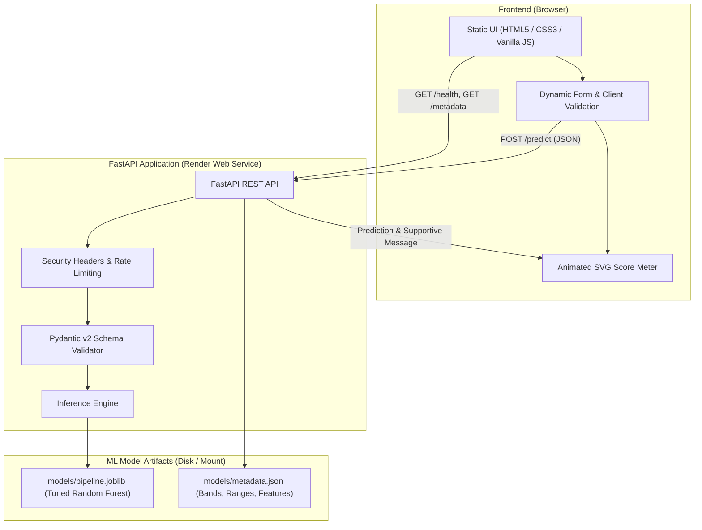

# Mental Health Score Predictor

[](https://github.com/your-org/mental-health-score-predictor/actions)
[](https://www.python.org/)
[](https://fastapi.tiangolo.com)
[](https://scikit-learn.org)
[](https://opensource.org/licenses/MIT)

> **Academic Context:** B.Tech Minor Project — Department of Computer Science & Engineering, Poornima University, Jaipur.  
> **Status:** Production-Ready, Decoupled Full-Stack Architecture.

---

## Important Ethical & Medical Disclaimer

> [!CAUTION]
> **THIS IS AN INFORMATIONAL SELF-SCREENING DEMO AND NOT A DIAGNOSTIC TOOL.**
> This application does **NOT** provide medical diagnosis, clinical advice, psychiatric evaluation, or treatment plans. If you or someone you know is experiencing emotional distress or mental health challenges, please reach out immediately to qualified professionals or national crisis support helplines:
> - **India (Tele-MANAS):** Call `14416` or `1800 891 4416` (24x7 Toll-Free)
> - **India (Vandrevala Foundation):** `+91 9999 666 555`
> - **India (KIRAN Mental Health Helpline):** `1800-599-0019`
> - **USA:** Call/Text `988` (Suicide & Crisis Lifeline)
> - **International:** [https://findahelpline.com](https://findahelpline.com)

---

## Project Overview

**Mental Health Score Predictor** is a modern, decoupled web application that estimates an individual's mental wellness score on a **0–100 scale** using daily lifestyle and behavioral indicators (physical activity, sleep duration, screen time, perceived stress level, country, and primary social platform).

The application leverages a machine learning pipeline with automated data cleaning, domain clipping, log-transformations, one-hot encoding with out-of-vocabulary handling, and a tuned **Random Forest Regressor** served via a hardened **FastAPI REST backend** to a responsive, zero-build **vanilla JavaScript frontend**.

---

## System Architecture



---

## Model Performance & Evaluation

Models were evaluated on a dedicated 30% held-out test split ($N=1,500$) after 5-fold cross-validation and IQR outlier removal on the training set:

| Model | Test $R^2$ Score | Mean CV $R^2$ | Mean Absolute Error (MAE) | Root Mean Squared Error (RMSE) |
|---|---|---|---|---|
| **Linear Regression (Baseline)** | 0.7786 | 0.8361 | 5.6245 | 7.8212 |
| **Random Forest (Tuned with RandomizedSearchCV)** | **0.8545** | **0.8585** | **4.8635** | **6.3409** |

*The pipeline automatically persists and serves the highest-performing model (Random Forest).*

---

## Quick Start (Run Locally in < 5 Commands)

### 1. Clone the repository and navigate to root:
```bash
git clone https://github.com/your-org/mental-health-score-predictor.git
cd mental-health-score-predictor
```

### 2. Install dependencies:
```bash
pip install -r backend/requirements.txt -r backend/requirements-dev.txt
```

### 3. Generate data and train the ML model:
```bash
make train
# Or: python scripts/generate_synthetic_data.py && python ml/train.py
```

### 4. Start the FastAPI backend:
```bash
make run-backend
# Or: uvicorn backend.app.main:app --host 127.0.0.1 --port 8000 --reload
```

### 5. Launch the Frontend:
Open `frontend/index.html` in any web browser, or serve it with Python:
```bash
python -m http.server 5500 --directory frontend
```
Visit `http://localhost:5500` in your browser!

---

## API Usage Examples

### Predict Wellness Score
```bash
curl -X POST "http://127.0.0.1:8000/predict" \
  -H "Content-Type: application/json" \
  -d '{
    "Physical_Activity_Hours": 2.0,
    "Sleep_Hours": 7.5,
    "Screen_Time_Hours": 4.5,
    "Stress_Level": "Low",
    "Country": "India",
    "Platform": "YouTube"
  }'
```

#### Sample Response:
```json
{
  "prediction_id": "c62bfd72-4753-4bf0-a292-80ea5ceb292e",
  "mental_health_score": 83.4,
  "status_flag": "Thriving",
  "color_code": "#2ecc71",
  "message": "You seem to be in great shape! Keep up those healthy habits.",
  "timestamp": "2026-09-29T15:40:00.000Z"
}
```

---

## Running Tests & Quality Checks

Run the automated test suite with coverage report:
```bash
pytest backend/tests -v --cov=backend/app --cov=ml --cov-report=term-missing
```

Format and lint with Ruff:
```bash
ruff check backend ml scripts
```

---

## Project Structure

```
mental-health-score-predictor/
├── data/
│   ├── raw/mental_health_data.csv
│   └── processed/mental_health_clean.csv
├── notebooks/
│   └── 01_eda.ipynb
├── ml/
│   ├── config.py
│   ├── data_cleaning.py
│   ├── features.py
│   ├── train.py
│   └── evaluate.py
├── backend/
│   ├── app/
│   │   ├── main.py
│   │   ├── schemas.py
│   │   ├── model_loader.py
│   │   ├── settings.py
│   │   └── security.py
│   ├── tests/
│   │   ├── conftest.py
│   │   ├── test_api.py
│   │   └── test_model.py
│   ├── requirements.txt
│   └── requirements-dev.txt
├── models/
│   ├── pipeline.joblib
│   ├── metrics.json
│   └── metadata.json
├── frontend/
│   ├── index.html
│   ├── styles.css
│   ├── app.js
│   └── config.js
├── docs/
│   ├── ARCHITECTURE.md
│   ├── API.md
│   ├── MODEL_CARD.md
│   ├── DEPLOYMENT.md
│   ├── SYNOPSIS_MAPPING.md
│   ├── VIVA_QA.md
│   └── figures/
├── .github/workflows/ci.yml
├── render.yaml
├── Makefile
├── .gitignore
└── README.md
```

---

## Assumptions & Disclosures

1. **Synthetic Training Baseline:** For demonstration purposes and privacy compliance, `scripts/generate_synthetic_data.py` generates 5,000 synthetic patient records. Replace with a real dataset for clinical research.
2. **Zero Data Retention:** No user lifestyle data or predictions are stored in any database or printed to logs.
3. **Decoupled Architecture:** Static site is designed to run independently of backend hosting (CORS enabled).
