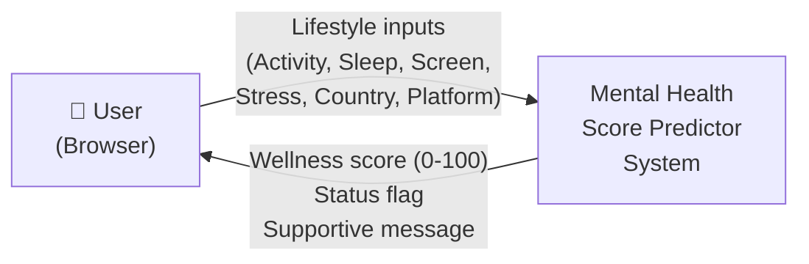
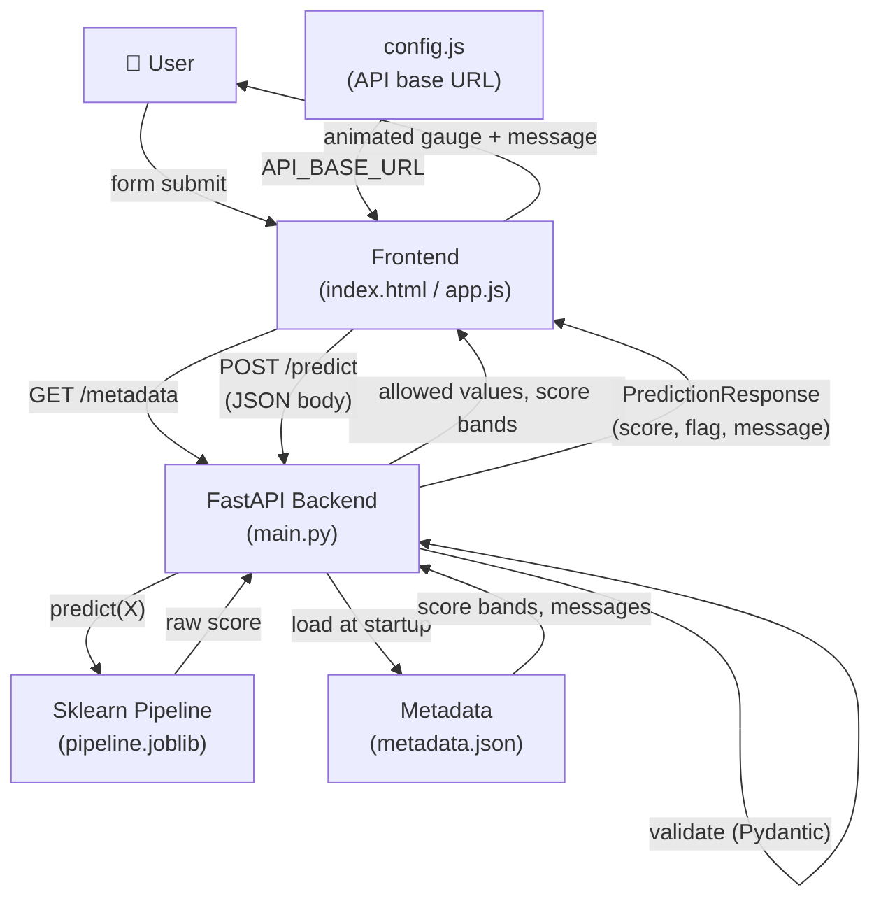
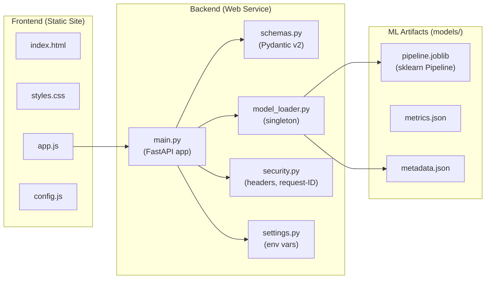
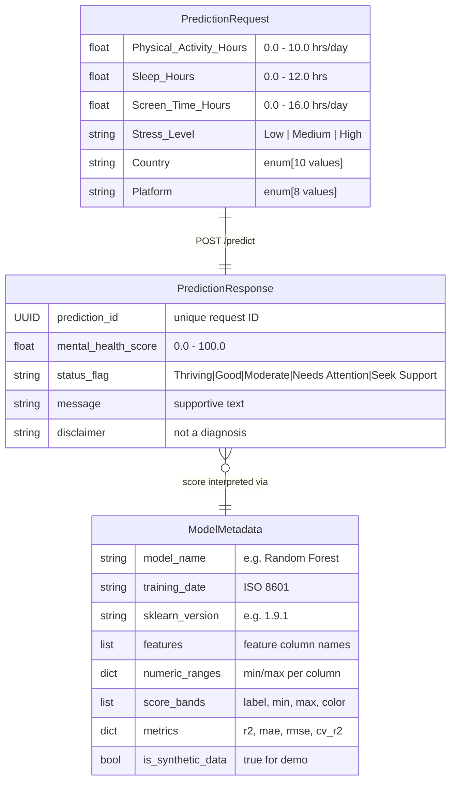
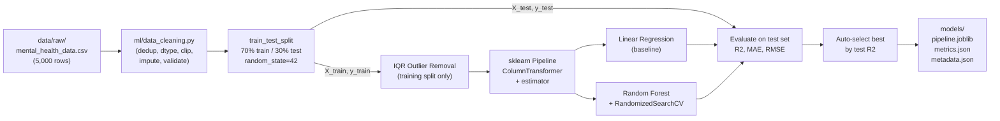

# docs/ARCHITECTURE.md
# Architecture — Mental Health Score Predictor

## System Overview

The application is split into two independently deployable services:

| Service | Technology | Deployed As |
|---------|-----------|-------------|
| API Backend | Python, FastAPI | Render Web Service |
| Frontend | HTML5, CSS3, Vanilla JS | Render Static Site |

There is **no database**. The API is stateless — no user data is stored anywhere.

---

## Level-0 DFD (Context Diagram)

---

## Level-1 DFD

---

## Component Diagram

---

## Request / Response Entity Diagrams

---

## Data Flow — Training Pipeline

---

## Security Architecture

| Layer | Mechanism |
|-------|-----------|
| CORS | `ALLOWED_ORIGINS` env var — whitelist-based |
| Rate limiting | slowapi — 30 req/min per IP |
| Security headers | `X-Frame-Options`, `X-Content-Type-Options`, etc. |
| Request tracing | UUID `X-Request-ID` on every response |
| Data privacy | No user input logged; no storage |
| Input validation | Pydantic v2 strict mode — 422 on bad values |
